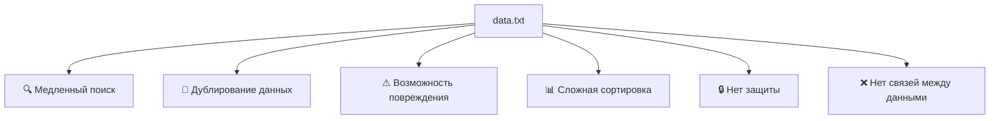
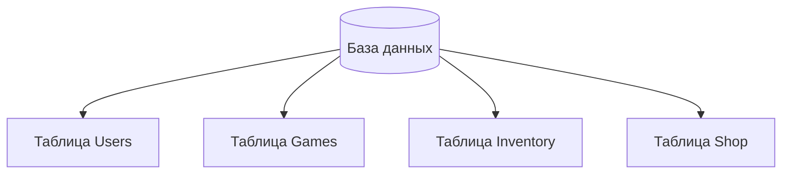

```mermaid
flowchart TD

TXT["data.txt"]

TXT --> Search["🔍 Медленный поиск"]

TXT --> Duplicate["📄 Дублирование данных"]

TXT --> Errors["⚠ Возможность повреждения"]

TXT --> Sort["📊 Сложная сортировка"]

TXT --> Security["🔒 Нет защиты"]

TXT --> Relations["❌ Нет связей между данными"]
%% zoom: {"scale":1,"x":0,"y":0}
```

 

 

 

 

 

```mermaid
flowchart TD

Database[(База данных)]

Database --> Users["Таблица Users"]

Database --> Games["Таблица Games"]

Database --> Inventory["Таблица Inventory"]

Database --> Shop["Таблица Shop"]
%% zoom: {"scale":2.44140625,"x":0,"y":0}
```