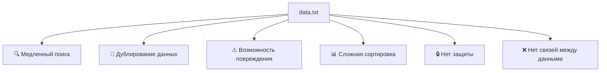

 

 

 

 

 

 

> [!diagram] Диаграмма

 

<svg width="18" height="18" viewBox="0 0 512 512" fill="currentColor"><path d="M256 512A256 256 0 1 0 256 0a256 256 0 1 0 0 512zm0-384c13.3 0 24 10.7 24 24V264c0 13.3-10.7 24-24 24s-24-10.7-24-24V152c0-13.3 10.7-24 24-24zM224 352a32 32 0 1 1 64 0 32 32 0 1 1 -64 0z"></path></svg>

Заметка

Текст заметки...

