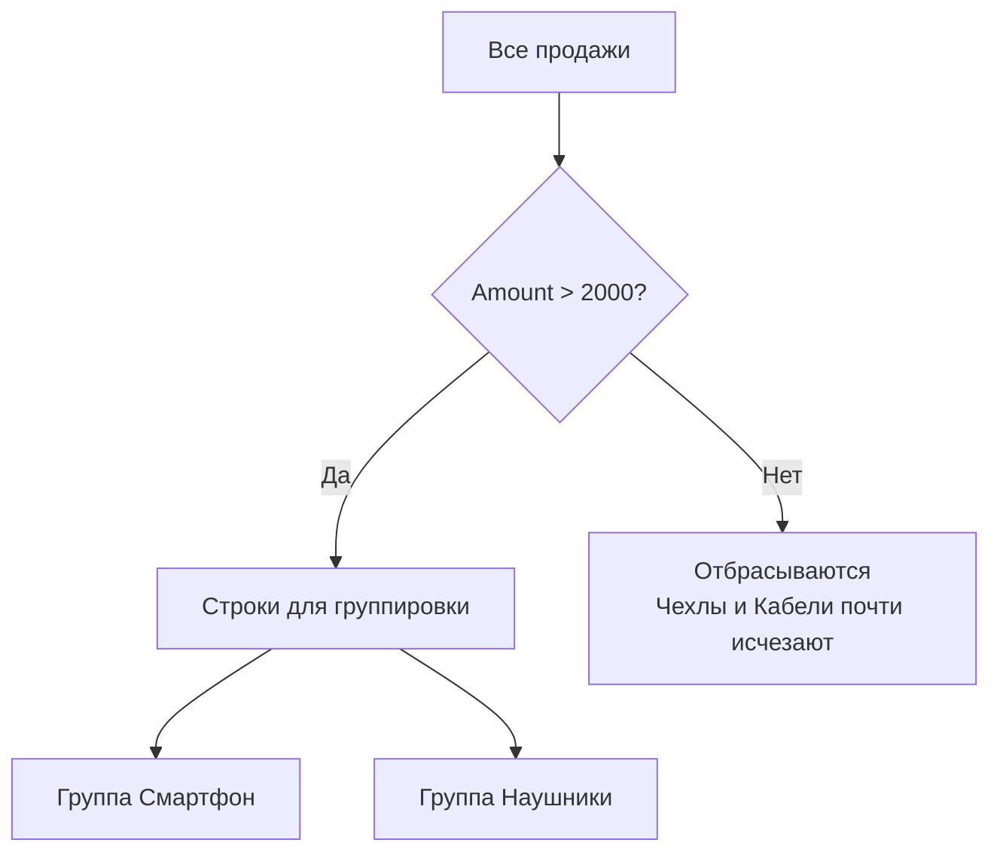

<svg width="18" height="18" viewBox="0 0 512 512" fill="currentColor"><path d="M256 512A256 256 0 1 0 256 0a256 256 0 1 0 0 512zm0-384c13.3 0 24 10.7 24 24V264c0 13.3-10.7 24-24 24s-24-10.7-24-24V152c0-13.3 10.7-24 24-24zM224 352a32 32 0 1 1 64 0 32 32 0 1 1 -64 0z"></path></svg>

Заметка

Текст заметки...

<svg width="18" height="18" viewBox="0 0 512 512" fill="currentColor" style="transform: rotate(90deg);"><path d="M260.353,254.878,131.538,33.1a2.208,2.208,0,0,0-3.829.009L.3,254.887A2.234,2.234,0,0,0,.3,257.122L129.116,478.9a2.208,2.208,0,0,0,3.83-.009L260.358,257.113A2.239,2.239,0,0,0,260.353,254.878Zm39.078-25.713a2.19,2.19,0,0,0,1.9,1.111h66.509a2.226,2.226,0,0,0,1.9-3.341L259.115,33.111a2.187,2.187,0,0,0-1.9-1.111H190.707a2.226,2.226,0,0,0-1.9,3.341ZM511.7,254.886,384.9,33.112A2.2,2.2,0,0,0,382.99,32h-66.6a2.226,2.226,0,0,0-1.906,3.34L440.652,256,314.481,476.66a2.226,2.226,0,0,0,1.906,3.34h66.6a2.2,2.2,0,0,0,1.906-1.112L511.7,257.114A2.243,2.243,0,0,0,511.7,254.886ZM366.016,284.917H299.508a2.187,2.187,0,0,0-1.9,1.111l-108.8,190.631a2.226,2.226,0,0,0,1.9,3.341h66.509a2.187,2.187,0,0,0,1.9-1.111l108.8-190.631A2.226,2.226,0,0,0,366.016,284.917Z"></path></svg>

Пример

Пример использования.

<svg width="18" height="18" viewBox="0 0 512 512" fill="currentColor" style="transform: rotate(90deg);"><path d="M260.353,254.878,131.538,33.1a2.208,2.208,0,0,0-3.829.009L.3,254.887A2.234,2.234,0,0,0,.3,257.122L129.116,478.9a2.208,2.208,0,0,0,3.83-.009L260.358,257.113A2.239,2.239,0,0,0,260.353,254.878Zm39.078-25.713a2.19,2.19,0,0,0,1.9,1.111h66.509a2.226,2.226,0,0,0,1.9-3.341L259.115,33.111a2.187,2.187,0,0,0-1.9-1.111H190.707a2.226,2.226,0,0,0-1.9,3.341ZM511.7,254.886,384.9,33.112A2.2,2.2,0,0,0,382.99,32h-66.6a2.226,2.226,0,0,0-1.906,3.34L440.652,256,314.481,476.66a2.226,2.226,0,0,0,1.906,3.34h66.6a2.2,2.2,0,0,0,1.906-1.112L511.7,257.114A2.243,2.243,0,0,0,511.7,254.886ZM366.016,284.917H299.508a2.187,2.187,0,0,0-1.9,1.111l-108.8,190.631a2.226,2.226,0,0,0,1.9,3.341h66.509a2.187,2.187,0,0,0,1.9-1.111l108.8-190.631A2.226,2.226,0,0,0,366.016,284.917Z"></path></svg>

Пример

Пример использования.

<svg width="18" height="18" viewBox="0 0 448 512" fill="currentColor"><path d="M349.4 44.6c5.9-13.7 1.5-29.7-10.6-38.5s-28.6-8-39.9 1.8l-256 224c-10 8.8-13.6 22.9-8.9 35.3S50.7 288 64 288H175.5L98.6 467.4c-5.9 13.7-1.5 29.7 10.6 38.5s28.6 8 39.9-1.8l256-224c10-8.8 13.6-22.9 8.9-35.3s-16.6-20.7-30-20.7H272.5L349.4 44.6z"></path></svg>

Ошибка

Что-то пошло не так.

<svg width="18" height="18" viewBox="0 0 24 24" fill="none" stroke="currentColor" stroke-width="2" stroke-linecap="round" stroke-linejoin="round"><rect x="9" y="9" width="13" height="13" rx="2" ry="2"></rect><path d="M5 15H4a2 2 0 0 1-2-2V4a2 2 0 0 1 2-2h9a2 2 0 0 1 2 2v1"></path></svg>

Цитата

Слова великих.

<svg width="18" height="18" viewBox="0 0 24 24" fill="none" stroke="currentColor" stroke-width="2" stroke-linecap="round" stroke-linejoin="round"><polyline points="20 6 9 17 4 12"></polyline></svg>

Успешно

Операция завершена.
<pre>

def calc_volume(a, b, c):
    print(f"a={a}, b={b}, c={c}")
    return a * b * c
v = calc_volume(1, 2, 3)
print(v)  # Вывод: a=1, b=2, c=3
6

</pre>

> [!diagram] Диаграмма
